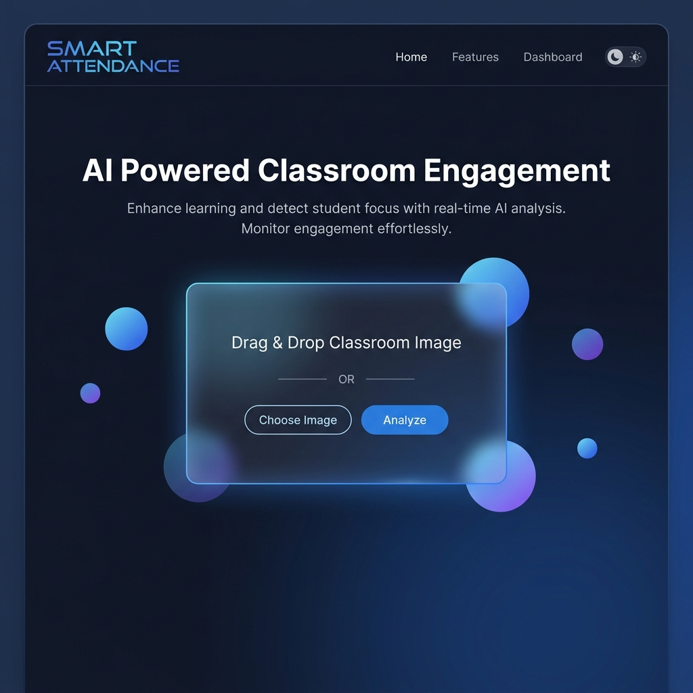
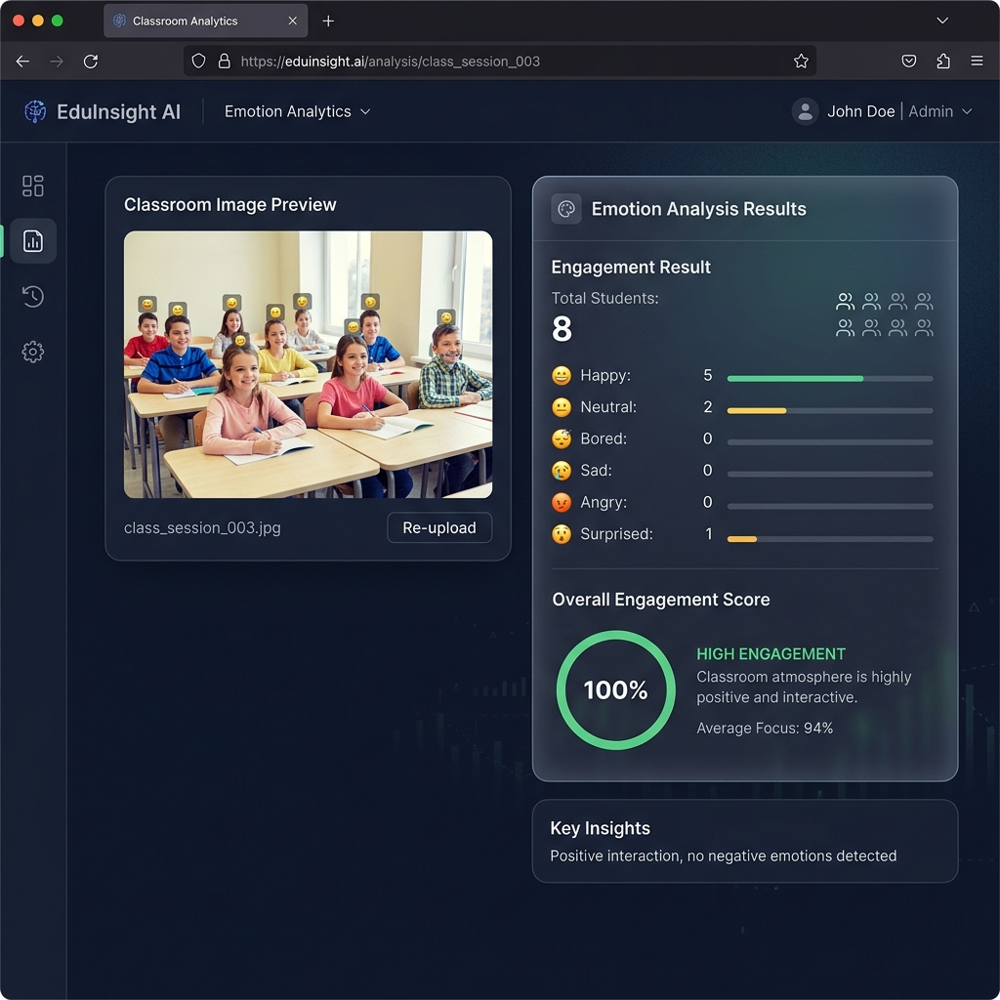
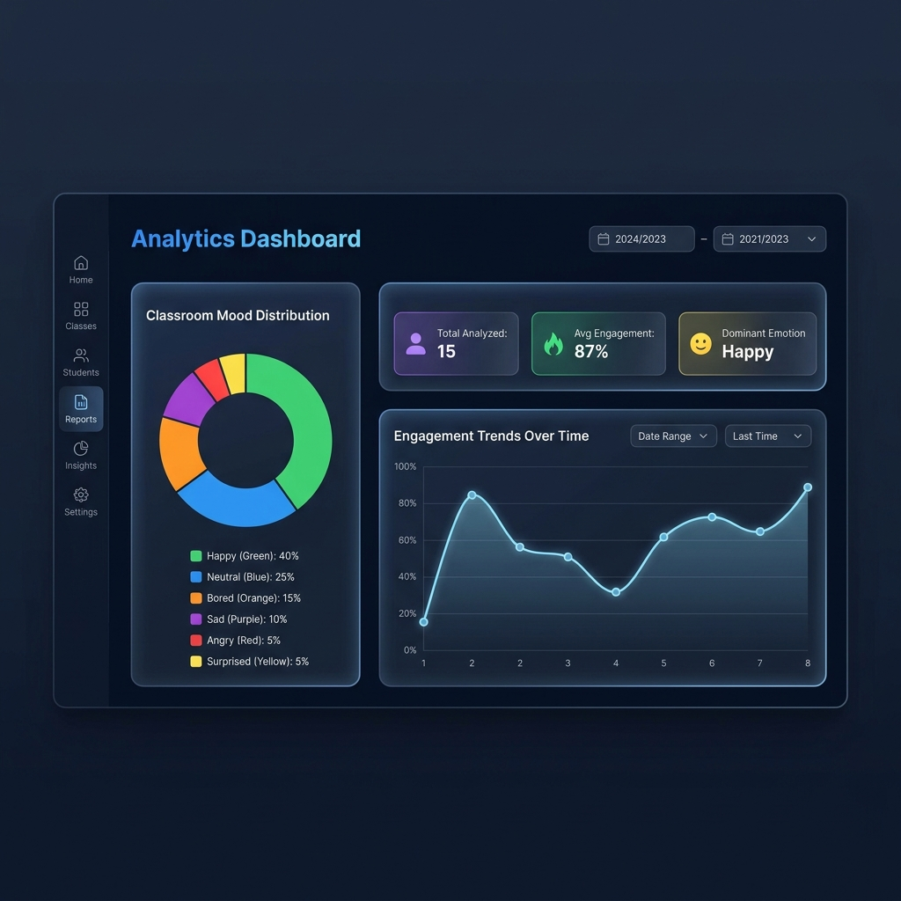
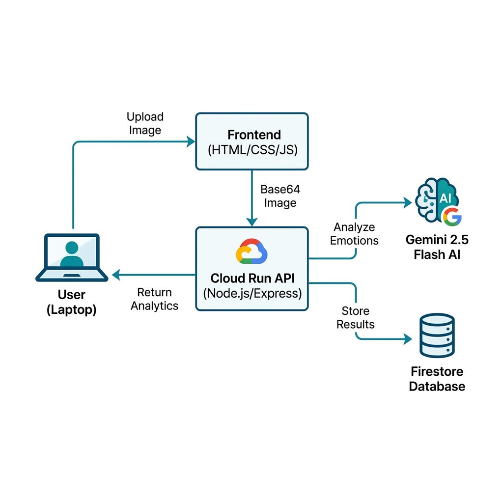
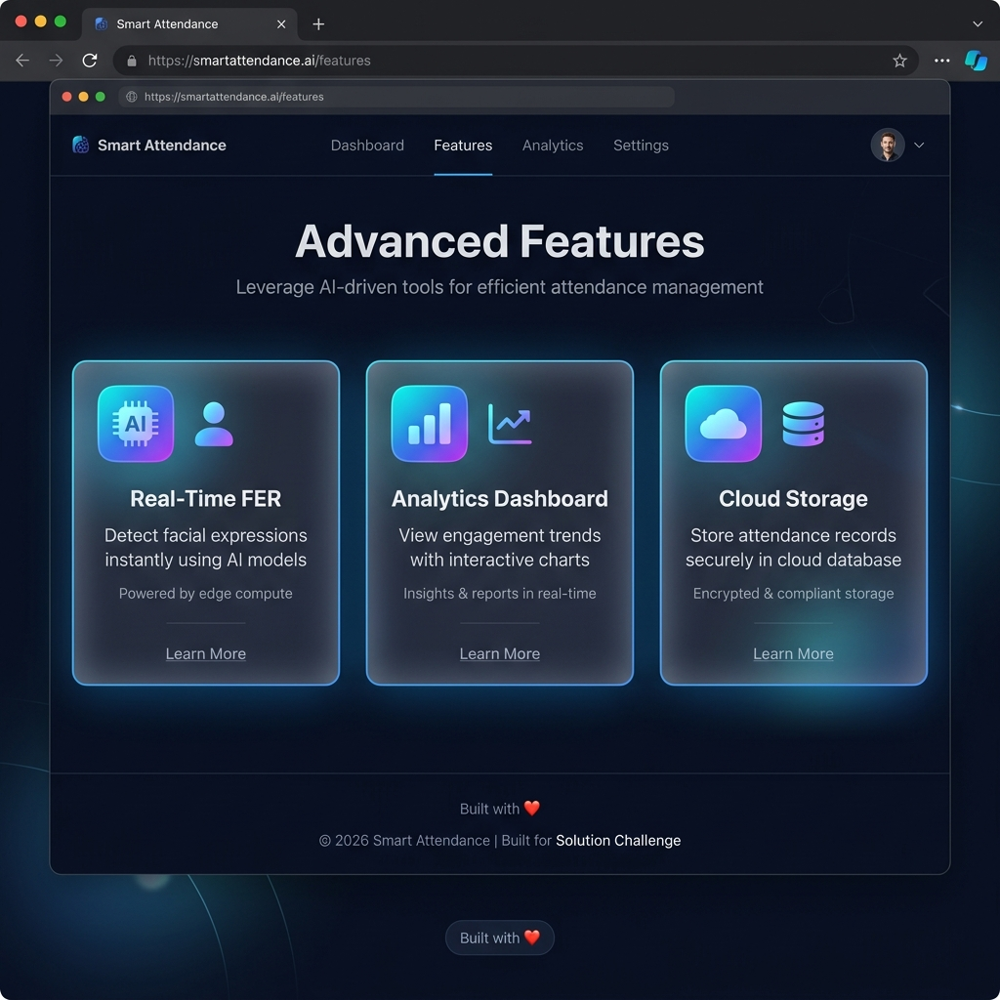
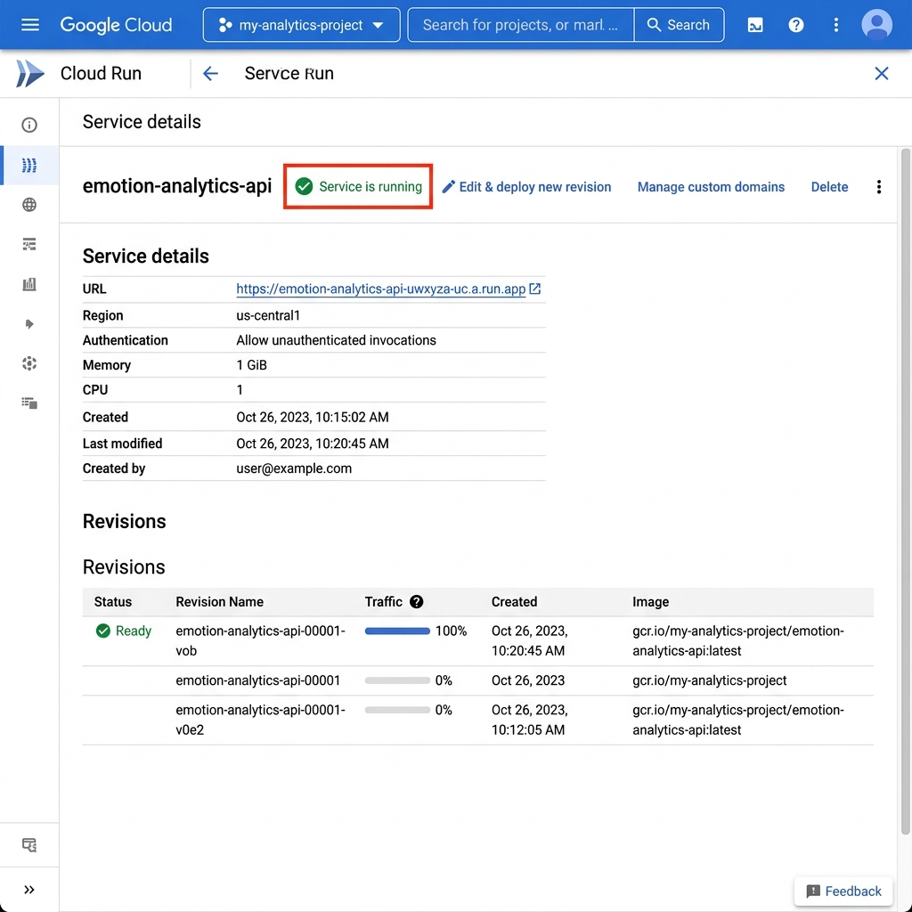

<div align="center">

# 🎓 Smart Attendance — AI-Powered Classroom Engagement System

### Real-Time Facial Expression Recognition using Google Gemini 2.5 Flash & Cloud Run

[](https://cloud.google.com/run)
[](https://ai.google.dev/)
[](https://firebase.google.com/products/firestore)
[](https://nodejs.org/)

**Built for the Google Solution Challenge 2026**

*Empowering educators with AI-driven insights to improve student engagement and learning outcomes.*

---

</div>

## 📸 Screenshots

### 🏠 Landing Page
Upload classroom images through an intuitive drag-and-drop interface with a modern, glassmorphism design.

<p align="center">
  
</p>

---

### 🔍 Emotion Analysis Results
The Gemini 2.5 Flash model detects and counts student emotions in real-time, providing granular emotion breakdowns and an overall engagement score.

<p align="center">
  
</p>

---

### 📊 Analytics Dashboard
Track engagement trends over time with interactive Chart.js visualizations, historical analysis cards with image previews, and detailed emotion breakdowns.

<p align="center">
  
</p>

---

### 🏗️ System Architecture
End-to-end cloud-native architecture leveraging Google Cloud services for scalability and reliability.

<p align="center">
  
</p>

---

### ⚡ Feature Highlights
Three core capabilities designed for real-world classroom environments.

<p align="center">
  
</p>

---

### ☁️ Cloud Run Deployment
Fully serverless deployment on Google Cloud Run with auto-scaling, secret management, and zero-downtime updates.

<p align="center">
  
</p>

---

## 🎯 Problem Statement

Traditional classroom engagement tracking relies on subjective teacher observation, which is:
- **Inconsistent** — varies by teacher experience and class size
- **Delayed** — teachers realize disengagement too late
- **Unscalable** — impossible to monitor 30+ students simultaneously

**Smart Attendance** solves this by providing **instant, objective, AI-driven engagement metrics** that help educators make data-informed decisions in real-time.

## 🌍 UN Sustainable Development Goal

<div align="center">

### SDG 4: Quality Education
*"Ensure inclusive and equitable quality education and promote lifelong learning opportunities for all"*

</div>

By giving teachers real-time visibility into student engagement, Smart Attendance helps:
- Identify struggling students before they fall behind
- Optimize teaching methods based on objective feedback
- Create more inclusive classrooms by detecting disengaged students who might otherwise go unnoticed

---

## 🛠️ Tech Stack

| Layer | Technology | Purpose |
|-------|-----------|---------|
| **Frontend** | HTML5, CSS3, JavaScript | Responsive UI with dark mode, glassmorphism design |
| **Backend API** | Node.js + Express | RESTful API server deployed on Cloud Run |
| **AI/ML** | Google Gemini 2.5 Flash | Facial Expression Recognition (FER) via vision model |
| **Database** | Cloud Firestore | NoSQL storage for analytics records with timestamps |
| **Hosting** | Google Cloud Run | Serverless container deployment with auto-scaling |
| **Secrets** | Secret Manager | Secure API key storage |
| **Charts** | Chart.js | Interactive engagement trend visualizations |

---

## 📁 Project Structure

```
├── Backend/
│   ├── index.js           # Express API server (Node.js)
│   ├── main.py            # Alternative Python/FastAPI server
│   ├── package.json       # Node.js dependencies
│   ├── Dockerfile         # Container build definition
│   ├── deploy.bat         # One-click deployment script
│   └── requirements.txt   # Python dependencies
│
├── Frontend/
│   ├── index.html         # Landing page with image upload
│   ├── dashboard.html     # Analytics dashboard
│   ├── script.js          # Upload & analyze logic
│   ├── dashboard.js       # Dashboard charts & history
│   ├── style.css          # Global styles (dark theme)
│   ├── auth.css           # Authentication styles
│   └── auth.js            # Authentication logic
│
├── docs/images/           # README screenshots
├── .gitignore
└── README.md
```

---

## 🚀 Getting Started

### Prerequisites
- [Node.js](https://nodejs.org/) v18+
- [Google Cloud CLI](https://cloud.google.com/sdk/docs/install)
- A [Gemini API Key](https://ai.google.dev/)
- A Google Cloud Project with Firestore enabled

### 1. Clone the Repository
```bash
git clone https://github.com/himshxmx/ai-fer-Google-sdk.git
cd ai-fer-Google-sdk
```

### 2. Install Backend Dependencies
```bash
cd Backend
npm install
```

### 3. Set Environment Variables
```bash
# Linux/Mac
export GEMINI_API_KEY="your-gemini-api-key"
export GOOGLE_CLOUD_PROJECT="your-project-id"
export PORT=8080

# Windows (cmd)
set GEMINI_API_KEY=your-gemini-api-key
set GOOGLE_CLOUD_PROJECT=your-project-id
set PORT=8080
```

### 4. Run Locally
```bash
npm start
# Server starts at http://localhost:8080
```

### 5. Open Frontend
Open `Frontend/index.html` in your browser and update `API_BASE` in `script.js` to `http://localhost:8080`.

---

## ☁️ Deploy to Google Cloud Run

Use the included deployment script:
```bash
cd Backend
deploy.bat
```

Or deploy manually:
```bash
gcloud run deploy emotion-analytics-api \
  --source . \
  --region us-central1 \
  --allow-unauthenticated \
  --set-secrets="GEMINI_API_KEY=gemini-api-key:latest" \
  --set-env-vars="GOOGLE_CLOUD_PROJECT=your-project-id" \
  --memory 1Gi \
  --cpu 1
```

---

## 🔌 API Endpoints

### `POST /analyze`
Analyze a classroom image for student emotions.

**Request:**
```json
{
  "image": "data:image/jpeg;base64,/9j/4AAQ..."
}
```

**Response:**
```json
{
  "total_students": 8,
  "happy": 5,
  "neutral": 2,
  "bored": 0,
  "sad": 0,
  "angry": 0,
  "surprised": 1,
  "engagement_percentage": 100,
  "attention_score": 1.31,
  "dominant_emotion": "happy",
  "inference_latency_ms": 1594.16,
  "total_latency_ms": 1786.49
}
```

### `GET /records`
Retrieve the last 30 analysis records from Firestore.

---

## 🧠 How It Works

1. **Upload** — Teacher uploads or drags a classroom photo
2. **Encode** — Image is converted to Base64 and sent to the Cloud Run API
3. **Analyze** — Gemini 2.5 Flash vision model detects facial expressions and counts emotions
4. **Compute** — Backend calculates engagement percentage, attention score, and dominant emotion
5. **Store** — Results are persisted in Cloud Firestore with timestamps
6. **Visualize** — Dashboard displays trends, history cards, and detailed emotion breakdowns

---

## 📊 Metrics Explained

| Metric | Formula |
|--------|---------|
| **Engagement %** | `(Happy + Neutral + Surprised) / Total × 100` |
| **Attention Score** | `(Happy×1.5 + Neutral×1.0 + Surprised×1.2 − Bored×1.0 − Sad×0.5 − Angry×0.5) / Total` |
| **Dominant Emotion** | The emotion with the highest count |

---

## 👥 Team

Built with ❤️ for the **Google Solution Challenge 2026**

---

## 📄 License

This project is open source and available under the [MIT License](LICENSE).
